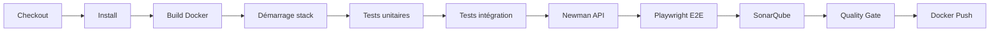

# CI/CD Jenkins — FutureKawa

Pipeline d'intégration continue conforme au livrable MSPR n°5 (build, tests, qualité, packaging Docker).

## Architecture



## Fichiers clés

| Fichier | Rôle |
|---|---|
| `ci-cd/Jenkinsfile` | Pipeline déclaratif Jenkins |
| `ci-cd/scripts/run_tests.sh` | Lanceur de tests (unit / integration / api / e2e / all) |
| `ci-cd/scripts/wait_for_stack.sh` | Attente des health checks avant tests |
| `ci-cd/scripts/build_images.sh` | Build + push images `futurekawa-*` |
| `ci-cd/sonar-project.properties` | Configuration SonarQube |
| `docker-compose.ci.yml` | Stack locale Jenkins + SonarQube |

## Installation locale (démo jury)

### 1. Démarrer Jenkins et SonarQube

```powershell
npm run ci:up
# Jenkins : http://localhost:8080
# SonarQube : http://localhost:9000
```

Mot de passe initial Jenkins :

```powershell
docker exec futurekawa-jenkins cat /var/jenkins_home/secrets/initialAdminPassword
```

### 2. Plugins Jenkins requis

- Pipeline
- SonarQube Scanner
- JUnit
- Docker Pipeline
- Git

### 3. Credentials Jenkins

| ID | Type | Usage |
|---|---|---|
| `dockerhub-credentials` | Secret text | Push Docker Hub |
| `sonar-token` | Secret text | Analyse SonarQube |

Configurer SonarQube dans **Manage Jenkins → System → SonarQube servers** :
- Name : `SonarQube`
- URL : `http://sonarqube:9000` (nom du service Docker, pas `localhost`)

### 4. Créer le job Pipeline

- **New Item** → Pipeline
- **Pipeline script from SCM** → Git → URL du repo
- **Script Path** : `ci-cd/Jenkinsfile`
- Branche : `develop` (intégration) ou `main` (release)

## Stages du pipeline

1. **Checkout** — récupération du code
2. **Install** — dépendances Python + Node
3. **Build** — `docker compose build`
4. **Démarrage stack** — `docker compose up -d` + attente health checks
5. **Tests unitaires** — pytest (sans Docker runtime)
6. **Tests intégration** — pytest + httpx sur APIs live
7. **Tests API** — Newman (collection Postman)
8. **Tests E2E** — Playwright (dashboard + détail lot)
9. **SonarQube** — analyse statique + coverage
10. **Quality Gate** — blocage si seuils non atteints
11. **Docker Push** — uniquement sur `main` / `develop`

## Images Docker Hub

```
futurekawa-bresil
futurekawa-equateur
futurekawa-colombie
futurekawa-siege-api
futurekawa-siege-front
```

Tag : SHA Git court (`git rev-parse --short HEAD`).

## Exécution manuelle (hors Jenkins)

```powershell
pip install -r tests/requirements.txt
npm install
docker compose up --build -d
bash ci-cd/scripts/wait_for_stack.sh
npm run test
```

## Preuve d'exécution pour la soutenance

À préparer :
1. Capture d'écran Jenkins **Stage View** (tous les stages verts)
2. Rapports JUnit archivés dans le build Jenkins
3. Dashboard SonarQube avec Quality Gate **PASSED**
4. Lien vers le Jenkinsfile versionné sur GitHub

## Arrêt de la stack CI

```powershell
npm run ci:down
```
