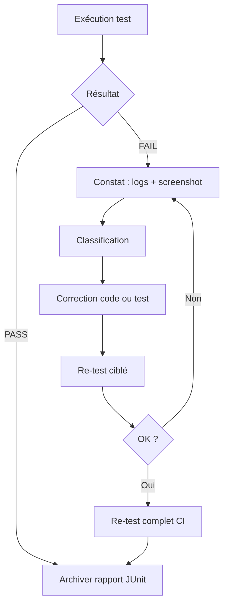

# Gestion des anomalies de tests

Processus appliqué conformément au critère MSPR « établir les plans de correction/d'amélioration ».

## Cycle de traitement



## Classification des anomalies

| Type | Exemple | Responsable | Action |
|---|---|---|---|
| **Bug applicatif** | Seuil alerte incorrect Colombie | Dev backend | Corriger `alert_service.py` |
| **Régression API** | `/stocks/` retourne 401 | Dev siège | Vérifier auth JWT |
| **Test obsolète** | Sélecteur CSS modifié | Dev tests | Mettre à jour spec Playwright |
| **Environnement** | MySQL pas prêt | DevOps | Augmenter timeout `wait_for_stack` |
| **Données** | Aucun lot en base E2E | Dev données | Exécuter `push_mysql_seed.py` |

## Grille de suivi (template)

| ID | Date | Test | Constats | Cause | Correction | Re-test | Statut |
|---|---|---|---|---|---|---|---|
| ANO-001 | — | — | — | — | — | — | Ouvert / Fermé |

## Commandes de re-test ciblé

```powershell
# Après correction d'un test unitaire
npm run test:unit

# Après correction API
npm run test:api

# Après correction UI
npm run test:e2e

# Validation complète avant merge
npm run test
```

## Escalade

1. **Niveau 1** : re-test local sur la branche feature
2. **Niveau 2** : pipeline Jenkins sur `develop`
3. **Niveau 3** : blocage merge si Quality Gate SonarQube FAILED
