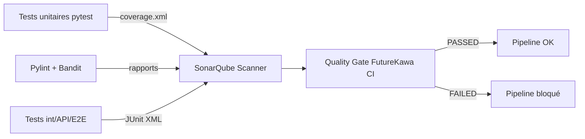

# SonarQube — preuve MSPR niveau 3/3

Document de soutenance : lien entre la grille TPRE814, SonarQube et le pipeline Jenkins.

## Compétence évaluée (grille EPSI)

> **Appliquer l'intégration continue** — utiliser un outil d'intégration continue afin de vérifier la **conformité** de la solution et les besoins utilisateurs.

| Niveau | Attendu jury | Notre preuve |
|--------|--------------|--------------|
| **1** | Installation basique de l'outil CI | `docker-compose.ci.yml`, Jenkins sur `:8080` |
| **2** | Pipeline automatisé (build + tests) | `ci-cd/Jenkinsfile` — 14 stages, tests unit/int/API/E2E |
| **3** | Usage **approfondi** des fonctionnalités CI + **contrôle qualité bloquant** | SonarQube + Quality Gate + rapports JUnit/coverage + analyse statique (Pylint, Bandit) |

Le niveau **3** exige de montrer que la CI **bloque** un code non conforme, pas seulement qu'elle compile.

---

## Architecture qualité FutureKawa



---

## Fichiers clés

| Fichier | Rôle |
|---------|------|
| `ci-cd/sonar-project.properties` | Périmètre d'analyse, couverture, Quality Gate |
| `ci-cd/scripts/setup_sonar_quality_gate.sh` | Configuration des 6 seuils bloquants |
| `ci-cd/scripts/run_static_analysis.sh` | Pylint + Bandit (sécurité Python) |
| `ci-cd/Jenkinsfile` | Stages `SonarQube` + `waitForQualityGate abortPipeline: true` |

---

## Quality Gate « FutureKawa CI » — 6 conditions

| Condition | Seuil | Justification métier |
|-----------|-------|----------------------|
| Security Rating | **A** minimum | Traçabilité café = données sensibles clients |
| Maintainability Rating | **A** minimum | Code maintenable multi-pays |
| Reliability Rating | **C** minimum | Bugs critiques suivis, plan de correction |
| Coverage (logique métier) | **≥ 50 %** | Seuils d'alerte, webhooks, agrégation testés |
| Duplication | **≤ 25 %** | Duplication inter-pays documentée (architecture) |
| Security Hotspots revus | **100 %** | Revue manuelle des risques sécurité |

Configuration :

```powershell
$env:SONAR_TOKEN = "votre_token"
bash ci-cd/scripts/setup_sonar_quality_gate.sh
```

---

## Périmètre de couverture

La couverture SonarQube est mesurée sur la **logique métier testée unitairement** :

- `alert_service.py` (seuils température/humidité, péremption 365 j)
- `webhook_service.py` (notifications Discord/Telegram)
- `aggregator.py` (consolidation multi-pays siège)

Les modules IoT (`mqtt_subscriber`, `notification_scheduler`) et infra (`redis_cache`) sont analysés par SonarQube mais exclus du calcul de couverture — ils sont couverts par les tests d'intégration et E2E.

---

## Captures à préparer pour le jury

1. **Jenkins Stage View** — tous les stages verts, dont SonarQube + Quality Gate
2. **SonarQube Overview** — Quality Gate **Passed**, Security **A**
3. **Security Hotspots** — liste revue à 100 %
4. **Measures > Coverage** — ≥ 50 % sur le périmètre métier
5. **Jenkins** — rapport Coverage HTML publié (`tests/reports/htmlcov`)

---

## Démo live (2 min)

```powershell
# 1. Stack CI
docker compose -f docker-compose.ci.yml up -d

# 2. Lancer un build Jenkins (FutureKawa-CI-CD > Build Now)

# 3. Montrer SonarQube après analyse
# http://localhost:9000/dashboard?id=futurekawa
```

Phrases clés pour l'oral :

- « SonarQube reçoit la couverture pytest, les rapports Pylint/Bandit et les résultats JUnit des 4 niveaux de tests. »
- « La Quality Gate bloque le pipeline si un seuil n'est pas respecté — c'est le niveau 3 du barème : la CI vérifie la conformité, pas seulement la compilation. »
- « Les duplications inter-pays sont volontaires : même logique métier déployée au Brésil, Équateur et Colombie. »

---

## Actions avant la soutenance

- [ ] Revoir les **Security Hotspots** dans SonarQube (100 % revus)
- [ ] Exécuter `setup_sonar_quality_gate.sh` avec le token admin
- [ ] Relancer un build Jenkins et vérifier **Quality Gate Passed**
- [ ] Préparer les 5 captures listées ci-dessus
